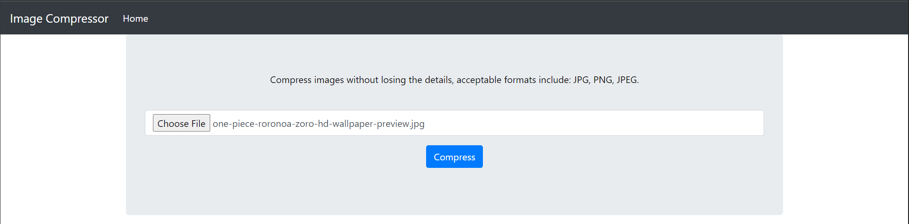
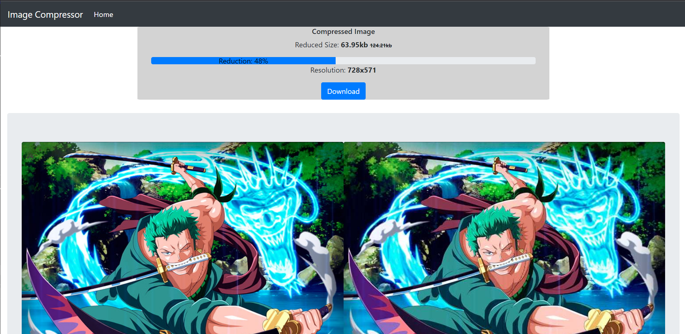

# Image Compressor
A web application for compressing images, with a simple user interface.  
The user uploads an image and the image is displayed alongside the compressed image  
with their corresponding display sizes.  

Check Out WebApp [here](https://imgcomp-app.herokuapp.com/).
  

